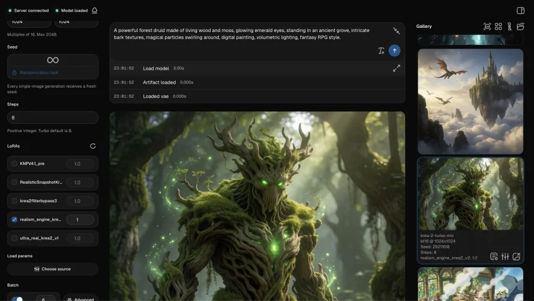
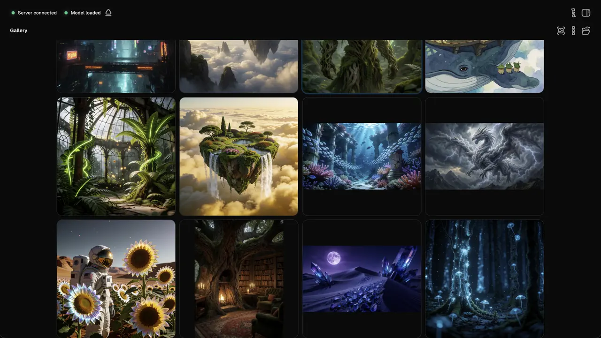
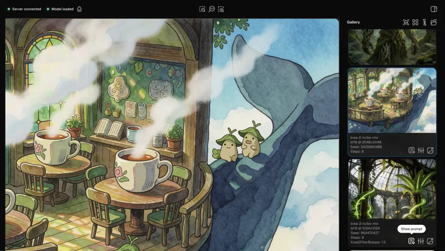
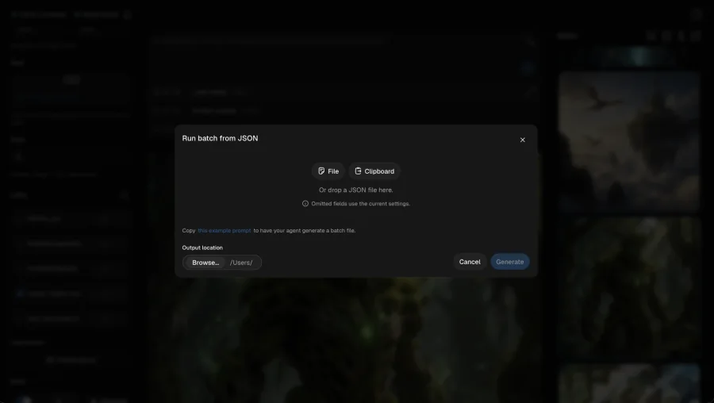
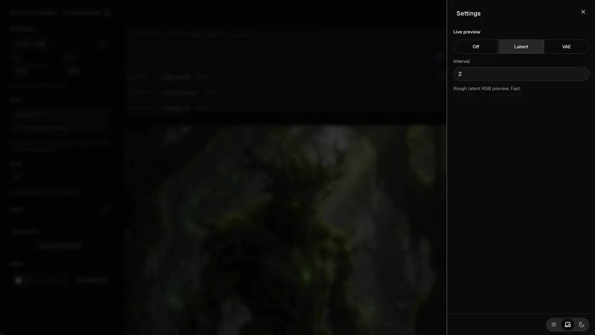
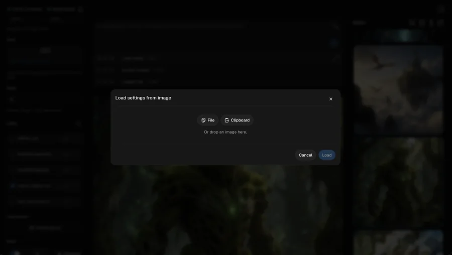

# krea-2-turbo-mlx

This project downloads the official full-precision (bf16) Krea 2 Turbo Diffusers release and converts it to a full-precision MLX artifact for use on Apple Silicon Macs.

## Screenshots

<p align="center">
  
</p>

| Gallery grid | Gallery detail | JSON batch |
| --- | --- | --- |
|  |  |  |
| Settings | Load settings | Main workspace |
|  |  |  |

## Features

- One-command setup flow with GUI or CLI.
  - Afterwards, use the double-clickable script to run the GUI.
- LoRA support. Just place them in the `loras/` folder.
- Runs a local web GUI for generation.
- Simple and advanced batch generation.
  - For advanced batches:
    - The GUI provides a prompt for you to have an AI generate the batch file. You can also write your own using the schema.
    - JSON files, or their text contents, are imported directly from the clipboard, drag-and-drop, or file selection.
    - Support for prompts, seeds, LoRA selections, and other parameters, or leaving them blank to use the GUI's present values.
- Gallery:
  - Intuitive keyboard shortcuts for entering/exiting, browsing, zooming, and deleting.
  - Shows a count indicating unseen new generations while browsing.
- Import params from a previous generation, directly in the GUI from the gallery, or from other local PNGs.

## Requirements

- macOS on Apple Silicon.
- About 50 GB of memory free during generation. The model is held resident and peaks near 49 GB, so this is on top of macOS and anything else you are running.
- Internet access for initial setup. The Krea weights download without a Hugging Face login.
- Recommend at least ~75 GB free storage for initial setup. Setup downloads the official source, writes a converted artifact, and needs extra headroom for temporary files, package caches, and the local toolchain.
- After setup:
  - About 34.63 GB for the converted MLX artifact.
  - About 35.68 GB more if keeping the official Krea source download.

## Quick Start

From the project root, run:

```bash
./setup.sh
```

This bootstraps the local toolchain, creates `.venv/`, installs the locked Python runtime dependencies, opens the setup choices page, then continues in Terminal to download, convert, and validate the model. When setup finishes, it creates `Launch Krea 2 Turbo.command`.

After setup, double-click:

```text
Launch Krea 2 Turbo.command
```

To use saved/default setup choices without opening the setup page:

```bash
./setup.sh --accept-defaults
```

> [!NOTE]
> See below for all setup flags and advanced CLI commands.

The GUI server binds to `127.0.0.1:8765` by default and uses a per-session token in the local URL.

## Files And Folders

- `models/`: downloaded official Diffusers source, if kept.
- `artifacts/krea-2-turbo-mlx/`: converted MLX artifact.
- `outputs/`: generated images.
- `loras/`: local LoRA `.safetensors` files. See `loras/README.md`.
- `.venv/`: project-local Python environment.
- `.toolchain/`: pinned uv, uv-managed Python, and fallback Node runtime.
- `.krea-2-turbo-mlx/`: setup config and GUI state.
- `frontend/build/client/`: included GUI build served by the local Python server.

These runtime folders are ignored by git.

## Command Model

For most users, `./setup.sh` is the installer and `Launch Krea 2 Turbo.command` is the launcher.

Advanced commands are available after setup through the project-local executable:

```bash
.venv/bin/krea-2-turbo-mlx --version
```

The shorter `krea-2-turbo-mlx` form works only when `.venv/bin` is already on your `PATH`, for example after activating the virtual environment.

If `frontend/build/client/index.html` is missing, use a release checkout that includes the GUI build. To intentionally rebuild the frontend from source, run setup with:

```bash
KREA_2_TURBO_MLX_BUILD_FRONTEND=1 ./setup.sh
```

## CLI Reference

Global option:

```bash
.venv/bin/krea-2-turbo-mlx --version
```

Setup:

```bash
.venv/bin/krea-2-turbo-mlx setup \
  [--config PATH] [--source REPO_OR_PATH] [--revision REV] \
  [--source-dir PATH] [--artifact-dir PATH] [--output-dir PATH] \
  [--lora-dir PATH] \
  [--cleanup-source | --keep-source] \
  [--accept-defaults] [--no-browser] [--dry-run]
```

`./setup.sh` accepts the same setup flags, but it bootstraps `.toolchain/` and `.venv/` before handing off to the Python setup command. The Python `setup --dry-run` command is side-effect-free: it validates and prints the setup plan without writing config, creating folders, downloading, converting, or cleaning up.

GUI:

```bash
.venv/bin/krea-2-turbo-mlx gui \
  [--config PATH] [--host HOST] [--port PORT] \
  [--no-browser] [--no-preload] [--unsafe-host]
```

Manifest:

```bash
.venv/bin/krea-2-turbo-mlx manifest \
  --source REPO_OR_PATH [--revision REV] [--output PATH]
```

Download:

```bash
.venv/bin/krea-2-turbo-mlx download \
  [--source REPO_OR_PATH] [--revision REV] [--dest PATH] [--json]
```

Convert:

```bash
.venv/bin/krea-2-turbo-mlx convert \
  --source REPO_OR_PATH [--revision REV] [--output PATH] \
  [--dry-run] [--source-dir PATH]
```

Doctor:

```bash
.venv/bin/krea-2-turbo-mlx doctor \
  [--source PATH] [--model PATH] [--runtime] [--json]
```

Generate:

```bash
.venv/bin/krea-2-turbo-mlx generate \
  --model PATH --prompt TEXT [--prompt TEXT ...] \
  [--width N] [--height N] [--seed N] [--seeds A,B,C] \
  [--steps N] [--guidance-scale 0.0] \
  [--lora ID_OR_PATH[:SCALE] ...] [--lora-dir PATH] \
  [--num-images N] [--output PATH] [--output-dir PATH] \
  [--output-template TEMPLATE] [--overwrite] [--json] \
  [--progress auto|always|never]
```

Generation defaults and constraints:

- Default size is `1024x1024`.
- Default steps is `8`.
- Default `--num-images` is `1`.
- Guidance scale is fixed to `0.0`.
- Width and height must be positive multiples of `16`, up to `2048`.
- Output files are PNG.
- `--output` is valid only for single-image generation.
- Seeds must be from `0` to `4294967295`.
- `--seed` increments across a batch; `--seeds` must provide one seed per generated image. Use one or the other, not both.
- `--output-template` can use `{seed}`, `{prompt_index}`, `{image_index}`, and `{batch_index}`.

## Licenses

Project code is licensed under Apache-2.0. See `LICENSE` and `NOTICE`.

Third-party components bundled in the included GUI build (fonts and JavaScript
libraries) are listed with their licenses in `THIRD-PARTY-NOTICES.md`.

### Model License

Krea model weights are separate and are governed by Krea's model-weight community license. Review the official Krea license before downloading or using weights:

<https://huggingface.co/krea/Krea-2-Turbo/blob/main/LICENSE.pdf>
